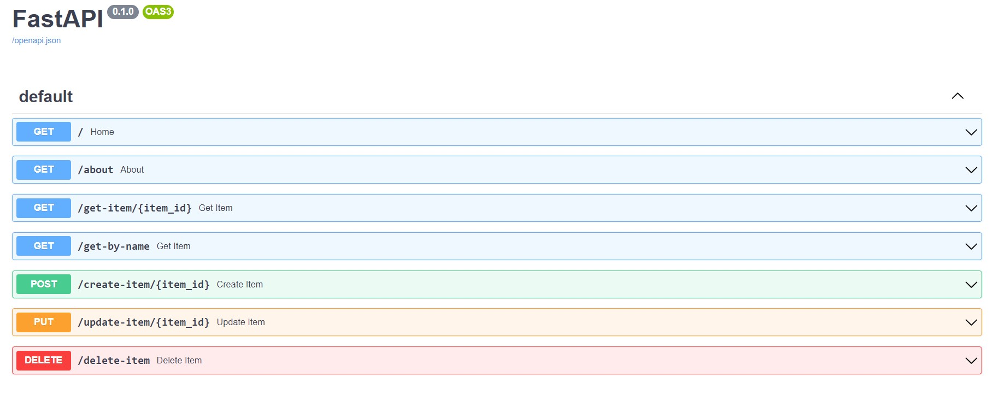

<h1>Example Fast API</h1> 

  
  
  

> Status do Projeto: concluído

### Tópicos 

:small_blue_diamond: [Descrição do projeto](#descrição-do-projeto)

:small_blue_diamond: [Funcionalidades](#funcionalidades)

:small_blue_diamond: [API](#API)

:small_blue_diamond: [Pré-requisitos](#pré-requisitos)

:small_blue_diamond: [Como-executar](#como-executar)

:small_blue_diamond: [Desenvolvedora](#Desenvolvedora)

## Descrição do projeto 

  Projeto backend realizado para aprender e praticar o uso do FastAPI e Uvicorn.

## Funcionalidades

:heavy_check_mark: CRUD de Itens 

:heavy_check_mark: Pesquisar por ID  

:heavy_check_mark: Pesquisar por nome

## API

## Pré-requisitos
Todas as dependencias estão listadas no arquivo requirement.txt e podem ser baixadas com o comando: pip install -r requirements.txt

:warning: [FastAPI](https://fastapi.tiangolo.com/)

:warning: [Uvicorn](https://www.uvicorn.org/)

## Como-executar:

Para rodar o exemplo, siga os passos:

1 - Baixe o projeto localmente (git clone)

2 - Crie o virtual env dentro da pasta do projeto (virtualenv venv)

3 - Ative o venv (Windows: venv\Scripts\activate)

4 - Execute o uvicorn (uvicorn working:app --reload)

5 - Acesse a url do swagger: http://127.0.0.1:8000/docs

## Desenvolvedora :

| [ Mayara Madeira Trevisol](https://github.com/mayara-mt) | 
|:--------------------------------------------------------------------------------------------------------------------------------------------------------------------------------------------------:|  